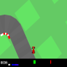
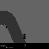
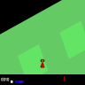
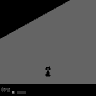
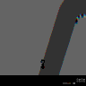
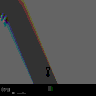
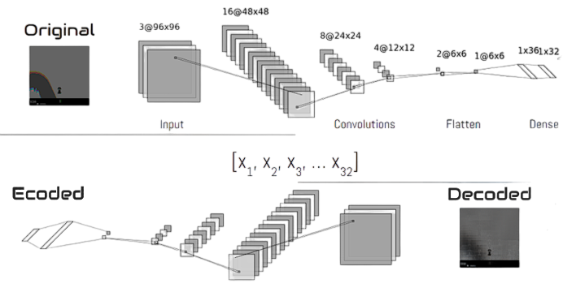
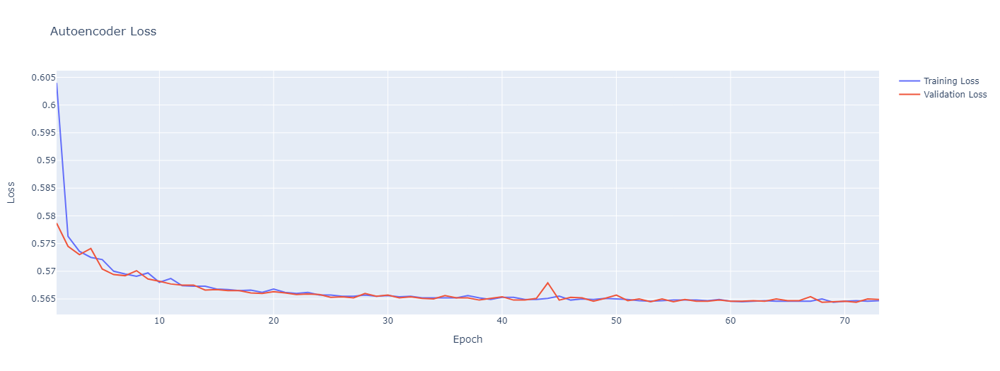
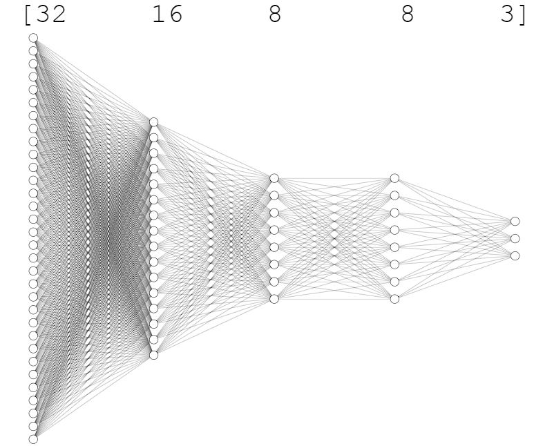
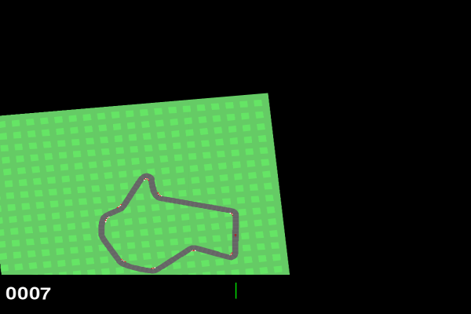

# Genetic-CarRacing-v2
Solving Gym's car racing environment with genetic algorithms, neural networks, and auto-encoders. A slight overkill for my final AP CS project, but it was fun nonetheless

# Encoding
- Compress the 96x96 RGB image into a 1D vector
- Speeds up evolutionary training 
- Simplifies genetic model architecture

## 1. Data Collection
- Random actions to gather frames
- Save every Nth image
  ### Image Procesing
  - Convert to grayscale
  - Remove grid patterns to reduce complexity
   

  | Original Image | Processed Image |
  | :----------------: | :----------------: |
  |  |  |
  |  |  |

  ### Stacking Frames
  - Stack 3 consecutive frames
  - Contains information to deduce velocity & acceleration
  
   
  
  | Slow | Fast |
  | :----------------: | :----------------: |
  |   Narrow outline indicates minimal   difference between frames|   Broad overlay indicates greater speed|

## 2. Model Architecture
- Compresses 96x96x3 image input into vector of 32 values
- 99.8843% reduction
- Fuse output of encoder with head of evolutionary model
### Auto-encoder
*Final result is Decoded - (Intermediate tensor of 32 values is Encoded)

  
## 3. Training
- Utilizing Google Colab's Tesla T4 GPU
 

# Evolutionary Algorithm
Producing the best agent through genetic selection

## Agent Model
  - Impemented in vanilla NumPy for speed and flexibility (reduces uneccesary overhead)
  - Potentially replace with pyTorch for larger models 
  - Shown below is the model archtecture for each individual

## Reproduction
  - The most successful agents of each generation make up the base population for the next generation
  - Each one also produces x number of "mutated" offspring with random values added to each weight
  - The table below indicates how many offspring each individual produces to maintain the population size of 30

Rank   | Mutant Offspring
| :------------: | :-------------: |
|1      |        10        |
|2      |        5         |
|3      |        4         |
|4      |        3         |
|5      |        2         |
|6      |        1         |
|Base      |        5         |
|Total Agents      |        30         |

## Training

(Max Reward)

## Results

| 
**0 Generations**
 | 
**20 Generations**
 |
| :------------: | :-------------: |
|  |  |
| 
**60 Generations**
 | 
**110 Generations**
 |
|  |  |

## Looking Back
Unfortunately, this agent would be pulled over for DUI within two minutes of hitting the road. While it is able to succesfully touch every tile on the track, it's speed could clearly be improved by taking the shortest path between 2 points, not the longest. This behavior likely provides some sort of strategic advantage or is a local optima for the agent's rewards. 
One explanation is the winding route provides the ability to estimate it's own velocity. On a perfectly straight track, each frame is identical to the next, providing no information regarding the velocity of the agent. By twisting through the track, the overlaying of images produces varience to determine the magnitude of direction of the car.
  
  ### Potential Improvements:
  - Maintain image complexity 
  - Integrate the encoder into the agent model and make the weights mutable
  - Implement mutations which change the architacture of the agent model rather than soley weight values (and record total reward/elapsed time to encourage smaller, faster models)

  

